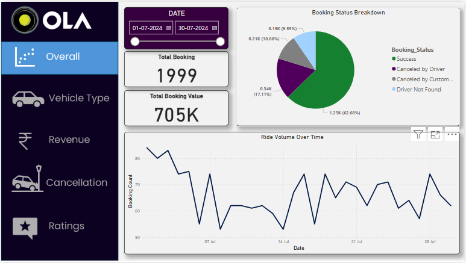
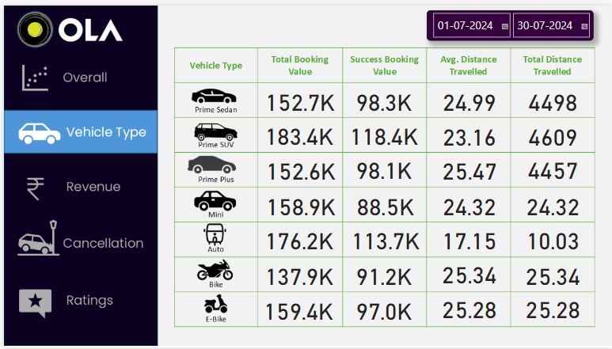
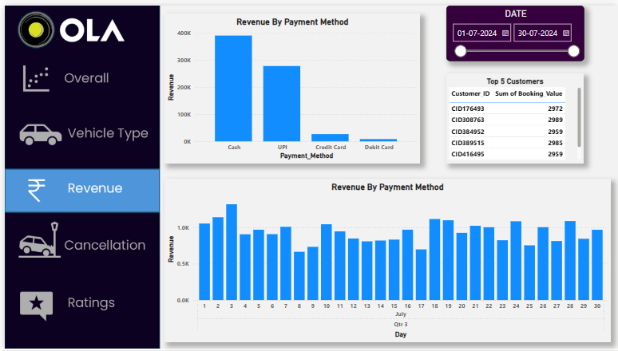
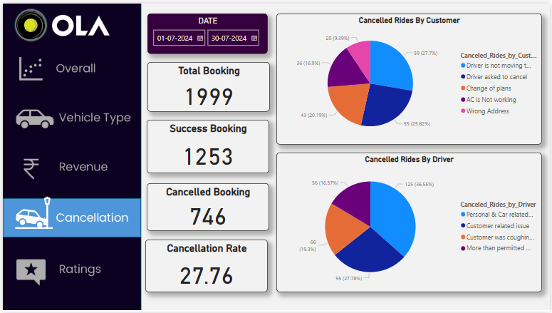
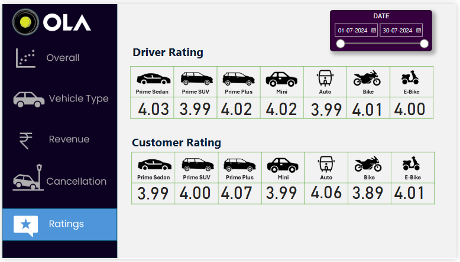

# 🚖 Ola Dashboard Analysis

Welcome to the **Ola Dashboard Analysis** project! This project aims to provide data-driven insights into Ola's ride-sharing operations using interactive dashboards built with Power BI (or your preferred tool). It covers key business metrics like revenue, bookings, cancellations, customer satisfaction, and more.

---

## 📊 Final Dashboard - Sales Overview

Below is our final dashboard representing sales and operational data visualizations for Ola:

### Dashboard Snapshots

#### 📈 Dashboard View 1

#### 📉 Dashboard View 2

#### 🚕 Dashboard View 3

#### 🧾 Dashboard View 4

#### 📌 Dashboard View 5

---

## 🧠 Key Insights

- **Booking Trends**: Identified peak hours and high-demand regions.
- **Revenue Streams**: Analyzed revenue generation by ride type and region.
- **Customer Behavior**: Monitored cancellation patterns and customer preferences.
- **Operational Efficiency**: Reviewed driver allocation, ride duration, and turnaround time.

---
<!-- 
## 📁 Project Structure
 -->
